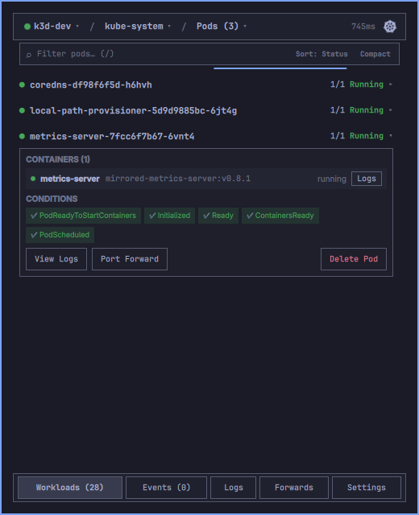

# OmaKube — Kubernetes Bar-Widget & Control Deck for Omarchy

**OmaKube** is an ultra-dense, keyboard-driven Kubernetes popup widget designed for the [Omarchy](https://omarchy.org/) desktop shell. It bridges the gap between lightweight status-bar widgets and full-featured desktop dashboards, scaling from single-node development clusters (`k3s`, `minikube`) to multi-tenant enterprise clusters with hundreds of namespaces, thousands of pods, and custom resource definitions (CRDs).

<p align="center">
  
</p>

---

## Highlights & Scalable Architecture

- **Single Anchored Layer-Shell Surface:** Rendered in-process by `omarchy-shell` via `KeyboardPanel` (`hyprctl clients` confirms zero floating window overhead).
- **Zone A: Smart Breadcrumb Header (34px):**
  - `[☸ Context ▾]` — Instant switcher with cluster reachability, health dots, node/pod metrics, and live API latency (`45ms`).
  - `[⎈ Namespace ▾]` — Searchable namespace drawer with pod counts, failure badges (`✕`), and **All Namespaces (`*`)** support.
  - `[⚡ Resource (Count) ▾]` — Categorized resource catalog: Workloads, Networking, Config/Storage, and dynamically discovered CRDs.
  - Background refresh indicator with animated Helm mark.
- **Zone B: Integrated Omnibar & Filter Strip (28px):**
  - Instant text filter (`/` to focus) supporting prefix syntax (`@namespace`, `:kind`).
  - Sort cycler (`Status`, `Name`, `Age`).
  - View density toggle (`Compact` 28px single-line row vs `Comfort` two-line row).
  - 2px accent shimmer line displaying non-intrusive background refresh activity.
- **Zone C: Virtualized Dynamic Canvas (~538px):**
  - **Workloads View:** Powered by virtualized `ListView` with delegate recycling. High data-ink ratio, inline container inspection, pod conditions, and quick actions (Logs, Port-Forward, Restart, Delete).
  - **Events View:** Virtualized cluster event stream with Warnings-only filter and instant text search.
  - **Logs View:** Full-height terminal canvas (~460px) with pod dropdown, container picker, search highlight navigation (`‹`, `›`), live follow toggle, and timestamped file exports with an **Open Folder** shortcut.
  - **Port Forwards View:** Active port-forward manager with live traffic routing, auto-assigned free port fallback, and 1-click stop.
  - **Settings View:** Clean, grouped configuration cards (Cluster Defaults, Logs & Telemetry, Safety & Permissions) with folder opener and read-only mode protection.
- **Zone D: Docked Bottom Navigation Rail (36px):**
  - Always visible regardless of scrolling: `[ Workloads ]` `[ Events ]` `[ Logs ]` `[ Forwards ]` `[ Settings ]`.
  - Notification badges for warning events and active port-forwards.

---

## Dynamic Resource Discovery

The backend Go CLI (`bin/omakube`) uses `client-go` and `DiscoveryClient.ServerPreferredResources()` along with the dynamic client (`dynamic.NewForConfig`) to query:
- **Workloads:** Pods, Deployments, StatefulSets, DaemonSets, Jobs, CronJobs
- **Network:** Services, Ingresses, Endpoints
- **Configuration & Storage:** ConfigMaps, Secrets, PersistentVolumeClaims (PVCs)
- **Custom Resource Definitions (CRDs):** Automatically discovers and catalogs custom resources installed on the cluster (e.g. `helmcharts`, `virtualservices`, `certificates`, `sealedsecrets`, etc.).
- **Multi-Namespace Scope:** Seamless querying across single namespaces or cluster-wide (`--all-namespaces` / `--namespace "*"`).

---

## Keyboard Shortcuts

| Shortcut | Action |
| :--- | :--- |
| **`/`** | Focus the Omnibar filter field (auto-selects text) |
| **`Esc`** | Clear active search filter, close open popovers, or dismiss popup |
| **`r` / `R`** | Trigger immediate cluster refresh |
| **`Enter` / `Shift+Enter`** | Step to next / previous match in log stream search |
| **`Up` / `Down` / `j` / `k`** | Navigate quick context switcher (right-click) |
| **`Left-Click (Pill)`** | Toggle full OmaKube control deck |
| **`Right-Click (Pill)`** | Quick context switcher dropdown |
| **`Middle-Click (Pill)`** | Trigger background refresh |

---

## Project Structure

```
├── manifest.json       # Omarchy plugin contract & configuration schema
├── LICENSE             # MIT License
├── Makefile            # Build recipe to compile backend from source
├── README.md           # Documentation & usage guide
├── preview.png         # Marketplace & README preview asset
├── Panel.qml           # Primary UI entry point (bar pill + popup + popovers)
├── Service.qml         # Asynchronous data owner & process supervisor
├── Model.js            # Pure functional helpers, status mappings, and log styling
├── OmakubeIcon.qml     # Helm-mark vector icon
├── bin/                # Target directory for compiled backend binary (bin/omakube)
└── backend/            # Go backend source code
    ├── main.go         # CLI entry point & argument parser
    ├── kube.go         # Kubeconfig resolution & client builder
    ├── resources.go    # Client factories & status mappers
    ├── workloads.go    # Workload browsing & dynamic CRD discovery
    ├── namespaces.go   # Namespace list with health counters
    ├── contexts.go     # Context list & active context switcher
    ├── events.go       # Cluster event streaming
    ├── logs.go         # Pod container log tailing & export
    ├── actions.go      # Restart deployment, delete pod
    └── portforward.go  # SPDY port-forward runner
```

---

## Prerequisites & Dependencies

- **Kubernetes Access:** Standard `~/.kube/config` or `$KUBECONFIG` with context(s) configured.
- **Go Toolchain:** Go 1.22+ (to compile the backend binary from reviewed source).
- **System Utilities:**
  - `make` (standard build tool, to invoke the Makefile).
  - `xdg-open` (standard on Omarchy/Linux) — used by the *Open Folder* button to open exported logs in your default file manager.

---

## Installation & Setup

### Quick Install (Omarchy CLI)

```bash
omarchy plugin add https://github.com/NethunRanasinghe/OmaKube.git --enable
make -C ~/.config/omarchy/plugins/omakube
```

### Manual Install

1. **Clone into Omarchy plugins directory:**
   ```bash
   git clone https://github.com/NethunRanasinghe/OmaKube.git ~/.config/omarchy/plugins/omakube
   ```
   *(Or link a local development checkout: `ln -sfn ~/MyData/Oma-Plugins/OmaKube ~/.config/omarchy/plugins/omakube`)*

2. **Build the backend binary from source:**
   ```bash
   cd ~/.config/omarchy/plugins/omakube
   make
   ```
   *This compiles `backend/` into `bin/omakube` using your local Go compiler from reviewed source.*

3. **Validate the plugin contract:**
   ```bash
   omarchy plugin validate ~/.config/omarchy/plugins/omakube
   ```

4. **Enable in your Omarchy bar:**
   ```bash
   omarchy plugin enable omakube --section right
   omarchy restart shell
   ```

5. **Verify popup rendering:**
   ```bash
   # Opening the popup should add NO new client (anchored layer-shell popup):
   hyprctl clients | grep -c "Window "
   ```

---

## Removal & Uninstallation

1. **Disable the widget from your Omarchy bar:**
   ```bash
   omarchy plugin disable omakube
   omarchy restart shell
   ```

2. **Remove plugin files completely:**
   ```bash
   rm -rf ~/.config/omarchy/plugins/omakube
   omarchy restart shell
   ```

*Note: Removing the plugin leaves your `$KUBECONFIG`, clusters, and exported log files (`~/omakube-logs`) untouched.*

---

## Configuration & Safety Guarantees

- **Non-Destructive by Default:** OmaKube respects user configuration and never alters global shell settings. It only saves user-configured preferences (e.g. default namespace, log export folder) within its own isolated `omakube` entry in `~/.config/omarchy/shell.json`.
- **Kubeconfig Integrity:** Clusters and credentials are read strictly via client-go and never copied, transmitted, or modified.
- **Confirmation Guards:** All mutating cluster actions (pod deletion, deployment rollout restart) require explicit confirmation dialog prompts naming the exact resource, namespace, and cluster.
- **Read-Only Mode:** Can be toggled on anytime in Settings to lock down all mutations and port-forwarding.

---

## Backend Development & Manual Testing

Compile the Go backend binary using `make`:

```bash
make
```

Or build manually via Go:

```bash
cd backend
CGO_ENABLED=0 go build -ldflags="-s -w" -o ../bin/omakube .
cd ..
```

Test commands manually:

```bash
./bin/omakube contexts --json
./bin/omakube health --context <name> --timeout 8
./bin/omakube workloads --context <name> --namespace default
./bin/omakube workloads --context <name> --all-namespaces
./bin/omakube namespaces --context <name>
./bin/omakube events --context <name> --namespace default
./bin/omakube logs --context <name> --namespace default --pod <pod> --tail 100
```

---

## License

This project is licensed under the [MIT License](LICENSE).
